# 📌Итоговое задание по модулю 6 (экзамен)
## Цели:
Научиться создавать слой DDS согласно методологии data vault с использованием инструмента Trino для реальных сценариев проектирования и загрузки данных в хранилища.
## 🔹Задачи:
1. Разработать модель данных.
2. Написать код для создания схемы dds и таблиц(хабы,линки,сателлиты) в ней.
3. Написать код загрузки данных из таблиц схемы tiny в таблицы в схеме dds.
4. Модифицировать код загрузки для загрузки данных за день,передаваемый как параметр

### Запускаем trino и подключаемся к базе
Запускаем trino через докер

Запускаем к базе через бобра. Делаем тестовый запрос


### 1. Анализ действующих таблиц
Смотрим на таблицы в схеме tiny 

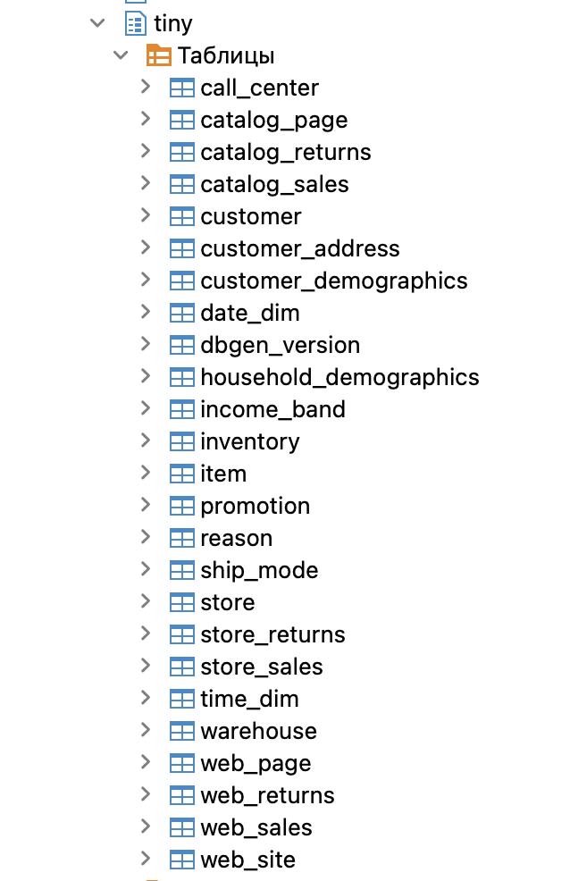

Cхема описна [тут](https://www.tpc.org/TPC_Documents_Current_Versions/pdf/TPC-H_v3.0.1.pdf) 

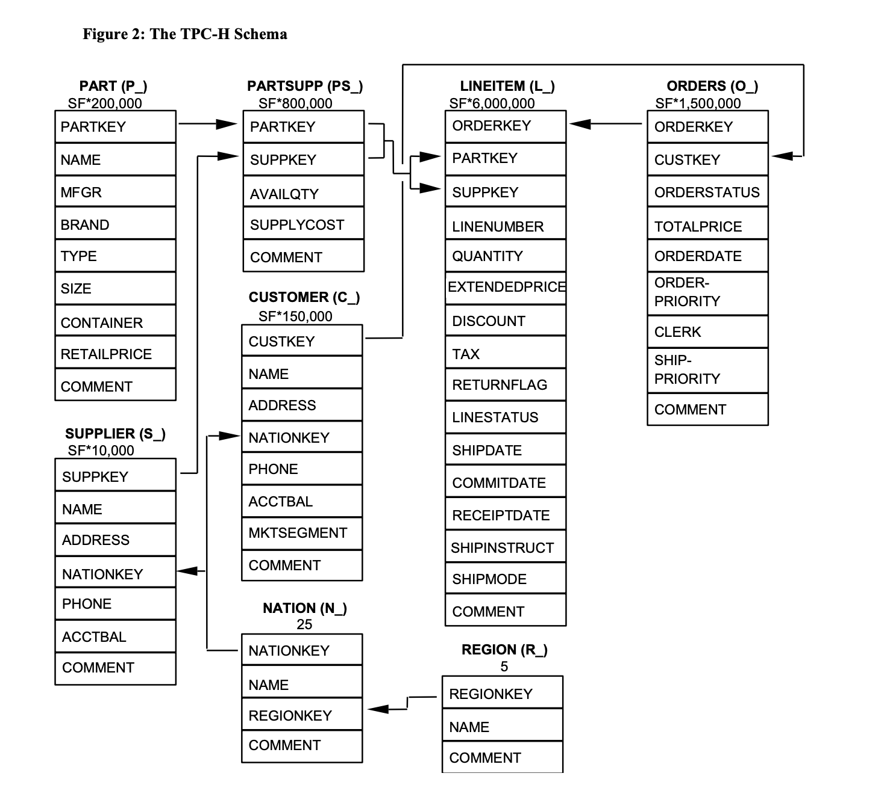

#### Таблица CUSTOMER - потребители 
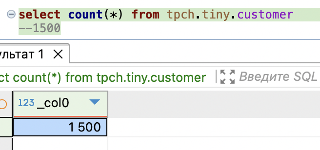
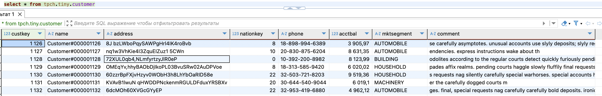
- таблица представляем собой справочник потребителей.

#### Таблица SUPPLIER - поставщики 
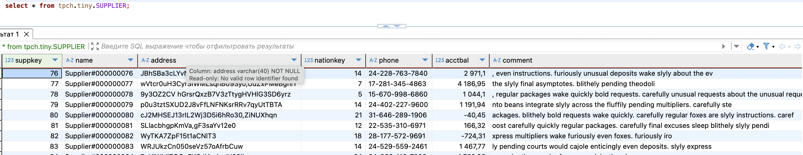
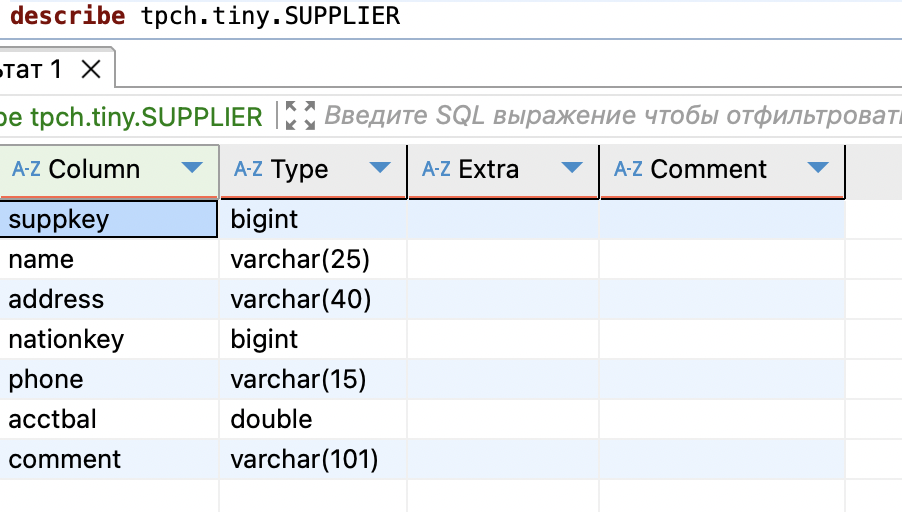
- таблица представляет собой справочник поставщиков.

#### Таблица PART - товары
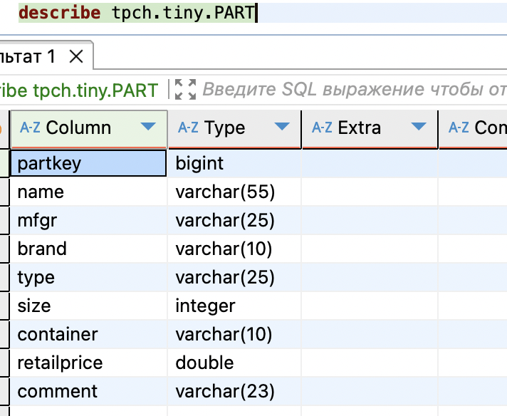
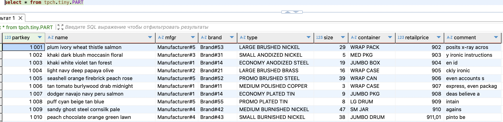
- в таблице представлен справочник товаров

#### Таблица PARTSUPP - поставщик–товар
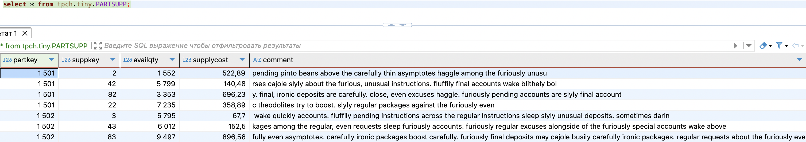
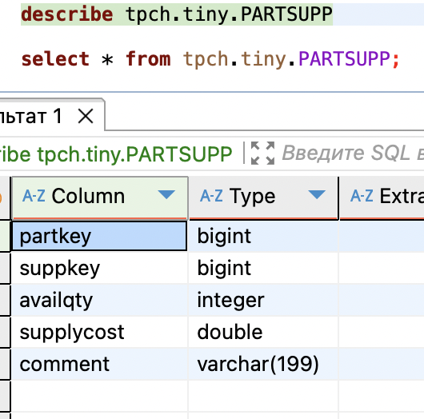
- в таблице представлены атрибуты поставки

#### Таблица ORDERS - заказы
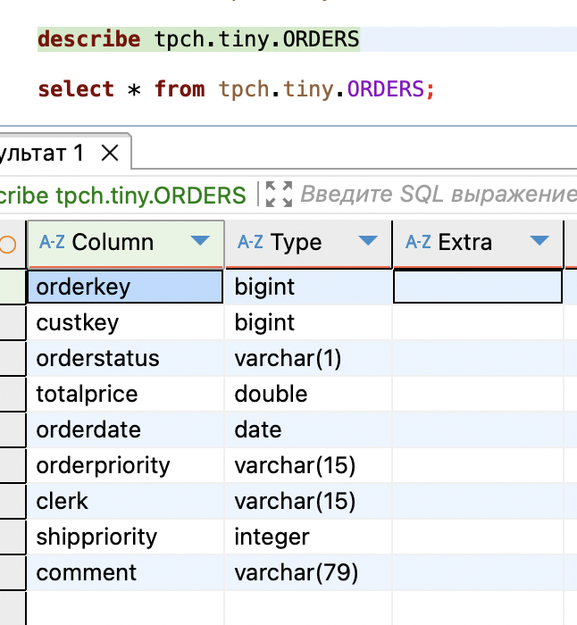
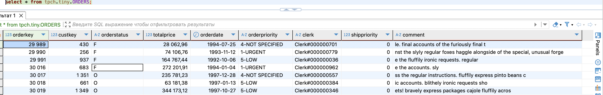
- в таблице представлены заказы. В файле описания указано, что не у всех клиентов есть заказы (часть клиентов “мертвые” для join’ов) — это заложено специально.

#### Таблица LINEITEM - спецификация заказа
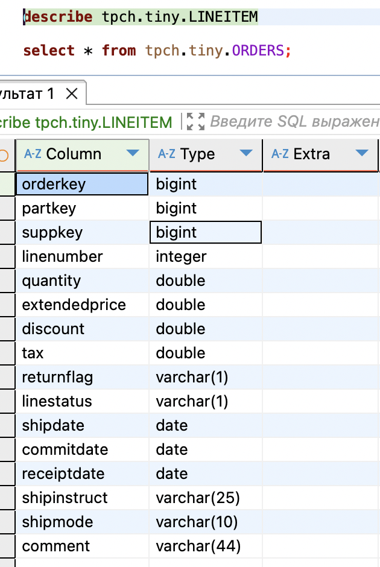
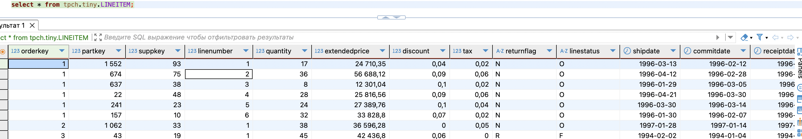
- в таблцие представлены строки заказа 

#### Таблица NATION - страны
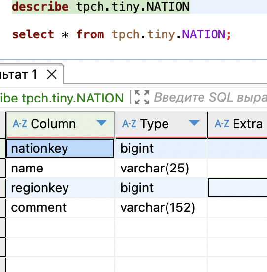
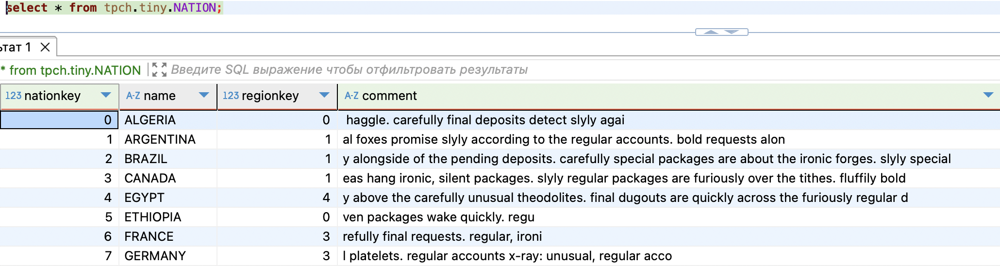
- в таблцие представлен справочник стран

#### Таблица REGION - REGION
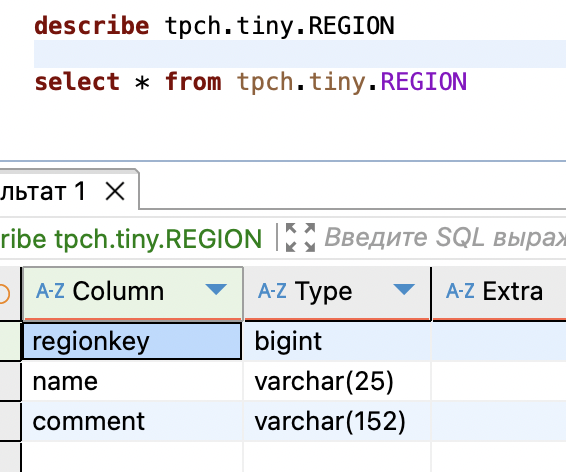
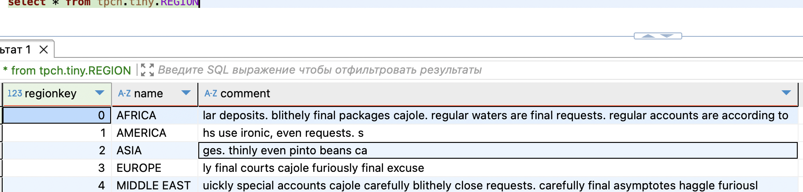
- в таблцие представлен справочник REGION

Если одной строкой, то связи такие:
- CUSTOMER.C_NATIONKEY => NATION.N_NATIONKEY  
- SUPPLIER.S_NATIONKEY => NATION.N_NATIONKEY  
- NATION.N_REGIONKEY => REGION.R_REGIONKEY  
- ORDERS.O_CUSTKEY => CUSTOMER.C_CUSTKEY  
- PARTSUPP.PS_PARTKEY => PART.P_PARTKEY, PARTSUPP.PS_SUPPKEY => SUPPLIER.S_SUPPKEY  
- LINEITEM.L_ORDERKEY => ORDERS.O_ORDERKEY, LINEITEM.L_PARTKEY => PART.P_PARTKEY, LINEITEM.L_SUPPKEY => SUPPLIER.S_SUPPKEY, (L_PARTKEY,L_SUPPKEY) => PARTSUPP 

### 2. Проектирование данных.
Ознакомившись с данными мы можем перейти к проектирование БД.

#### Бизнес‑сущности и ключи
Доступные домены (из исходных таблиц TPC-H)

__Справочники/мастера__:
- Клиенты: CUSTOMER
- Поставщики: SUPPLIER
- Товары: PART
- География: REGION, NATION (и ссылки на них из customer/supplier)
- Заказы (шапка): ORDERS
- Позиции заказа: LINEITEM
- Связь товар–поставщик + атрибуты поставки: PARTSUPP

#### Факты/метрики (числовые показатели):
- По заказу: O_TOTALPRICE
- По позиции: L_QUANTITY, L_EXTENDEDPRICE, L_DISCOUNT, L_TAX
  
__Выбор хабов (Hubs)__

##### HUB_CUSTOMER
- Бизнес-ключ: C_CUSTKEY
- Почему хаб: клиент — независимая сущность.

##### HUB_SUPPLIER
- Бизнес-ключ: S_SUPPKEY
- Почему хаб: поставщик — независимая сущность.

##### HUB_PART
- Бизнес-ключ: P_PARTKEY
- Почему хаб: товар/деталь — независимая сущность.

##### HUB_ORDER
- Бизнес-ключ: O_ORDERKEY
- Почему хаб: заказ — сущность “шапка документа”.

##### HUB_LINEITEM
- Бизнес-ключ (составной): L_ORDERKEY | L_LINENUMBER
- Почему хаб: позиция заказа — “строка документа” (часто моделируют как отдельную сущность, потому что у строки много атрибутов и дат).

##### HUB_NATION
- Бизнес-ключ: N_NATIONKEY
- Почему хаб: страна — справочник.

##### HUB_REGION
- Бизнес-ключ: R_REGIONKEY
- Почему хаб: регион - справочник.

Про PARTSUPP: его можно делать как HUB, но чаще и чище в DV: link PART↔SUPPLIER + satellite атрибутов поставки


#### Линки (Links)

##### LNK_ORDER_CUSTOMER
- Связь: ORDER <=> CUSTOMER (из ORDERS.O_CUSTKEY)
- Бизнес-состав ключа линка: хэш от BK заказа и BK клиента
- Смысл: фиксируем отношения “заказ принадлежит клиенту”.

##### LNK_LINEITEM_ORDER
- Связь: LINEITEM <=> ORDER (из LINEITEM.L_ORDERKEY)
- Смысл: строка принадлежит конкретному заказу.

##### LNK_LINEITEM_PART
- Связь: LINEITEM <=> PART (из LINEITEM.L_PARTKEY)
- Смысл: строка ссылается на товар.

##### LNK_LINEITEM_SUPPLIER
- Связь: LINEITEM <=> SUPPLIER (из LINEITEM.L_SUPPKEY)
- Смысл: строка ссылается на поставщика.

##### LNK_CUSTOMER_NATION
- Связь: CUSTOMER <=> NATION (из CUSTOMER.C_NATIONKEY)
- Смысл: геопривязка клиента.

##### LNK_SUPPLIER_NATION
- Связь: SUPPLIER <=> NATION (из SUPPLIER.S_NATIONKEY)
- Смысл: геопривязка поставщика.

##### LNK_NATION_REGION
- Связь: NATION <=> REGION (из NATION.N_REGIONKEY)
- Смысл: иерархия географии.

##### LNK_PART_SUPPLIER
- Связь: PART <=> SUPPLIER (источник: PARTSUPP(PS_PARTKEY, PS_SUPPKEY))
- Смысл: это M:N связь “поставщик поставляет товар”.

#### Сателлиты (Satellites)

##### SAT_CUSTOMER_ATTR (к HUB_CUSTOMER)
- Атрибуты: C_NAME, C_ADDRESS, C_PHONE, C_ACCTBAL, C_MKTSEGMENT, C_COMMENT
- (NATIONKEY лучше не хранить тут как атрибут, а связью через LNK_CUSTOMER_NATION)

##### SAT_SUPPLIER_ATTR (к HUB_SUPPLIER)
- Атрибуты: S_NAME, S_ADDRESS, S_PHONE, S_ACCTBAL, S_COMMENT

##### SAT_PART_ATTR (к HUB_PART)
- Атрибуты: P_NAME, P_MFGR, P_BRAND, P_TYPE, P_SIZE, P_CONTAINER, P_RETAILPRICE, P_COMMENT

##### SAT_ORDER_ATTR (к HUB_ORDER)
- Атрибуты: O_ORDERSTATUS, O_TOTALPRICE, O_ORDERDATE, O_ORDERPRIORITY, O_CLERK, O_SHIPPRIORITY, O_COMMENT
- Тут же обычно удобно держать O_ORDERDATE как “бизнес-дату” для инкрементальной загрузки.

##### SAT_LINEITEM_ATTR (к HUB_LINEITEM)
- Атрибуты: L_QUANTITY, L_EXTENDEDPRICE, L_DISCOUNT, L_TAX, L_RETURNFLAG, L_LINESTATUS, L_SHIPDATE, L_COMMITDATE, L_RECEIPTDATE, L_SHIPINSTRUCT, L_SHIPMODE, L_COMMENT

##### SAT_NATION_ATTR (к HUB_NATION)
- Атрибуты: N_NAME, N_COMMENT

##### SAT_REGION_ATTR (к HUB_REGION)
- Атрибуты: R_NAME, R_COMMENT

##### SAT_PART_SUPPLIER_ATTR (к LNK_PART_SUPPLIER)
- Атрибуты связи поставки: PS_AVAILQTY, PS_SUPPLYCOST, PS_COMMENT
- Это прямой аналог твоего SAT_SALE_METRICS, только для “связи поставки”.

#### Общие правила 
__Hash-keys (hub/link)__
- *_hk = md5(to_utf8(upper(trim(concat_ws('|', ...)))))

##### Примеры бизнес-состава:
- customer_hk = md5( to_utf8(upper(trim(cast(C_CUSTKEY as varchar))) ))
- link_order_customer_hk = md5( to_utf8(upper(trim(concat_ws('|', O_ORDERKEY, C_CUSTKEY)))) )
- lineitem_hk = md5( to_utf8(upper(trim(concat_ws('|', L_ORDERKEY, L_LINENUMBER)))) )

##### Hashdiff в сателлитах
- hashdiff = md5(upper(to_utf8(trim(concat_ws('|', <все атрибуты версии> )))))
- Используем для детекта изменений и SCD2.

##### SCD2 во всех SAT
Обязательные поля в каждом SAT:
| Поле | Назначение  |
|--------------|--------------|
| start_date  | дата начала действия версии |
| end_date | дата окончания действия версии |
| is_current | флаг актуальной версии |
| hashdiff | хэш атрибутов для детекта изменений |
| navi_date | техническая дата загрузки (аналог load_dts) |
| record_source | источник данных |

__Открытая версия__
- end_date = DATE '9999-12-31'
- is_current = true

### 3. Создание таблиц и их наполнение
Сначала создаём схему dds
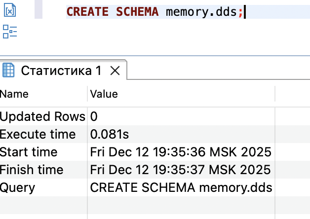

__Создаём хабы__
``` sql
CREATE TABLE IF NOT EXISTS memory.dds.hub_customer (
  customer_hk     VARBINARY,
  customer_bk     VARCHAR,
  navi_date       TIMESTAMP,
  record_source   VARCHAR
);

CREATE TABLE IF NOT EXISTS memory.dds.hub_supplier (
  supplier_hk     VARBINARY,
  supplier_bk     VARCHAR,
  navi_date       TIMESTAMP,
  record_source   VARCHAR
);

CREATE TABLE IF NOT EXISTS memory.dds.hub_part (
  part_hk         VARBINARY,
  part_bk         VARCHAR,
  navi_date       TIMESTAMP,
  record_source   VARCHAR
);

CREATE TABLE IF NOT EXISTS memory.dds.hub_order (
  order_hk        VARBINARY,
  order_bk        VARCHAR,
  navi_date       TIMESTAMP,
  record_source   VARCHAR
);

CREATE TABLE IF NOT EXISTS memory.dds.hub_lineitem (
  lineitem_hk     VARBINARY,
  lineitem_bk     VARCHAR,   -- ORDERKEY|LINENUMBER
  navi_date       TIMESTAMP,
  record_source   VARCHAR
);

CREATE TABLE IF NOT EXISTS memory.dds.hub_nation (
  nation_hk       VARBINARY,
  nation_bk       VARCHAR,
  navi_date       TIMESTAMP,
  record_source   VARCHAR
);

CREATE TABLE IF NOT EXISTS memory.dds.hub_region (
  region_hk       VARBINARY,
  region_bk       VARCHAR,
  navi_date       TIMESTAMP,
  record_source   VARCHAR
);
```

__Создаём линки__
```sql
CREATE TABLE IF NOT EXISTS memory.dds.lnk_order_customer (
  lnk_hk          VARBINARY,
  order_hk        VARBINARY,
  customer_hk     VARBINARY,
  navi_date       TIMESTAMP,
  record_source   VARCHAR
);

CREATE TABLE IF NOT EXISTS memory.dds.lnk_lineitem_order (
  lnk_hk          VARBINARY,
  lineitem_hk     VARBINARY,
  order_hk        VARBINARY,
  navi_date       TIMESTAMP,
  record_source   VARCHAR
);

CREATE TABLE IF NOT EXISTS memory.dds.lnk_lineitem_part (
  lnk_hk          VARBINARY,
  lineitem_hk     VARBINARY,
  part_hk         VARBINARY,
  navi_date       TIMESTAMP,
  record_source   VARCHAR
);

CREATE TABLE IF NOT EXISTS memory.dds.lnk_lineitem_supplier (
  lnk_hk          VARBINARY,
  lineitem_hk     VARBINARY,
  supplier_hk     VARBINARY,
  navi_date       TIMESTAMP,
  record_source   VARCHAR
);

CREATE TABLE IF NOT EXISTS memory.dds.lnk_customer_nation (
  lnk_hk          VARBINARY,
  customer_hk     VARBINARY,
  nation_hk       VARBINARY,
  navi_date       TIMESTAMP,
  record_source   VARCHAR
);

CREATE TABLE IF NOT EXISTS memory.dds.lnk_supplier_nation (
  lnk_hk          VARBINARY,
  supplier_hk     VARBINARY,
  nation_hk       VARBINARY,
  navi_date       TIMESTAMP,
  record_source   VARCHAR
);

CREATE TABLE IF NOT EXISTS memory.dds.lnk_nation_region (
  lnk_hk          VARBINARY,
  nation_hk       VARBINARY,
  region_hk       VARBINARY,
  navi_date       TIMESTAMP,
  record_source   VARCHAR
);

CREATE TABLE IF NOT EXISTS memory.dds.lnk_part_supplier (
  lnk_hk          VARBINARY,
  part_hk         VARBINARY,
  supplier_hk     VARBINARY,
  navi_date       TIMESTAMP,
  record_source   VARCHAR
);
```

__Создаём саттелиты__
```sql
CREATE TABLE IF NOT EXISTS memory.dds.sat_customer_attr (
  customer_hk     VARBINARY,
  c_name          VARCHAR,
  c_address       VARCHAR,
  c_phone         VARCHAR,
  c_acctbal       DOUBLE,
  c_mktsegment    VARCHAR,
  c_comment       VARCHAR,
  hashdiff        VARBINARY,
  start_date      DATE,
  end_date        DATE,
  is_current      BOOLEAN,
  navi_date       TIMESTAMP,
  record_source   VARCHAR
);

CREATE TABLE IF NOT EXISTS memory.dds.sat_supplier_attr (
  supplier_hk     VARBINARY,
  s_name          VARCHAR,
  s_address       VARCHAR,
  s_phone         VARCHAR,
  s_acctbal       DOUBLE,
  s_comment       VARCHAR,
  hashdiff        VARBINARY,
  start_date      DATE,
  end_date        DATE,
  is_current      BOOLEAN,
  navi_date       TIMESTAMP,
  record_source   VARCHAR
);

CREATE TABLE IF NOT EXISTS memory.dds.sat_part_attr (
  part_hk         VARBINARY,
  p_name          VARCHAR,
  p_mfgr          VARCHAR,
  p_brand         VARCHAR,
  p_type          VARCHAR,
  p_size          INTEGER,
  p_container     VARCHAR,
  p_retailprice   DOUBLE,
  p_comment       VARCHAR,
  hashdiff        VARBINARY,
  start_date      DATE,
  end_date        DATE,
  is_current      BOOLEAN,
  navi_date       TIMESTAMP,
  record_source   VARCHAR
);

CREATE TABLE IF NOT EXISTS memory.dds.sat_order_attr (
  order_hk        VARBINARY,
  o_orderstatus   VARCHAR,
  o_totalprice    DOUBLE,
  o_orderdate     DATE,
  o_orderpriority VARCHAR,
  o_clerk         VARCHAR,
  o_shippriority  INTEGER,
  o_comment       VARCHAR,
  hashdiff        VARBINARY,
  start_date      DATE,
  end_date        DATE,
  is_current      BOOLEAN,
  navi_date       TIMESTAMP,
  record_source   VARCHAR
);

CREATE TABLE IF NOT EXISTS memory.dds.sat_lineitem_attr (
  lineitem_hk     VARBINARY,
  l_quantity      DOUBLE,
  l_extendedprice DOUBLE,
  l_discount      DOUBLE,
  l_tax           DOUBLE,
  l_returnflag    VARCHAR,
  l_linestatus    VARCHAR,
  l_shipdate      DATE,
  l_commitdate    DATE,
  l_receiptdate   DATE,
  l_shipinstruct  VARCHAR,
  l_shipmode      VARCHAR,
  l_comment       VARCHAR,
  hashdiff        VARBINARY,
  start_date      DATE,
  end_date        DATE,
  is_current      BOOLEAN,
  navi_date       TIMESTAMP,
  record_source   VARCHAR
);

CREATE TABLE IF NOT EXISTS memory.dds.sat_nation_attr (
  nation_hk       VARBINARY,
  n_name          VARCHAR,
  n_comment       VARCHAR,
  hashdiff        VARBINARY,
  start_date      DATE,
  end_date        DATE,
  is_current      BOOLEAN,
  navi_date       TIMESTAMP,
  record_source   VARCHAR
);

CREATE TABLE IF NOT EXISTS memory.dds.sat_region_attr (
  region_hk       VARBINARY,
  r_name          VARCHAR,
  r_comment       VARCHAR,
  hashdiff        VARBINARY,
  start_date      DATE,
  end_date        DATE,
  is_current      BOOLEAN,
  navi_date       TIMESTAMP,
  record_source   VARCHAR
);

CREATE TABLE IF NOT EXISTS memory.dds.sat_part_supplier_attr (
  lnk_hk          VARBINARY,  -- satellite of LNK_PART_SUPPLIER
  ps_availqty     INTEGER,
  ps_supplycost   DOUBLE,
  ps_comment      VARCHAR,
  hashdiff        VARBINARY,
  start_date      DATE,
  end_date        DATE,
  is_current      BOOLEAN,
  navi_date       TIMESTAMP,
  record_source   VARCHAR
);
```

Далее наполним их данными 

__Заполняем хабы__
```sql
INSERT INTO memory.dds.hub_customer
SELECT DISTINCT
  md5(to_utf8(upper(trim(cast(custkey as varchar)))))   AS customer_hk,
  upper(trim(cast(custkey as varchar)))                 AS customer_bk,
  current_timestamp                                     AS navi_date,
  'tpch.tiny.customer'                                  AS record_source
FROM tpch.tiny.customer;

INSERT INTO memory.dds.hub_supplier
SELECT DISTINCT
  md5(to_utf8(upper(trim(cast(suppkey as varchar)))))   AS supplier_hk,
  upper(trim(cast(suppkey as varchar)))                 AS supplier_bk,
  current_timestamp,
  'tpch.tiny.supplier'
FROM tpch.tiny.supplier;

INSERT INTO memory.dds.hub_part
SELECT DISTINCT
  md5(to_utf8(upper(trim(cast(partkey as varchar)))))   AS part_hk,
  upper(trim(cast(partkey as varchar)))                 AS part_bk,
  current_timestamp,
  'tpch.tiny.part'
FROM tpch.tiny.part;

INSERT INTO memory.dds.hub_order
SELECT DISTINCT
  md5(to_utf8(upper(trim(cast(orderkey as varchar)))))   AS order_hk,
  upper(trim(cast(orderkey as varchar)))                                      AS order_bk,
  current_timestamp,
  'tpch.tiny.orders'
FROM tpch.tiny.orders;

INSERT INTO memory.dds.hub_lineitem
SELECT DISTINCT
  md5(to_utf8(upper(trim(concat_ws('|',
      cast(orderkey as varchar),
      cast(linenumber as varchar)
  )))))                                                                        AS lineitem_hk,
  upper(trim(concat_ws('|',
      cast(orderkey as varchar),
      cast(linenumber as varchar)
  )))                                                                         AS lineitem_bk,
  current_timestamp,
  'tpch.tiny.lineitem'
FROM tpch.tiny.lineitem;

INSERT INTO memory.dds.hub_nation
SELECT DISTINCT
  md5(to_utf8(upper(trim(cast(nationkey as varchar)))))                                AS nation_hk,
  upper(trim(cast(nationkey as varchar)))                                     AS nation_bk,
  current_timestamp,
  'tpch.tiny.nation'
FROM tpch.tiny.nation;

INSERT INTO memory.dds.hub_region
SELECT DISTINCT
  md5(to_utf8(upper(trim(cast(regionkey as varchar)))))                                AS region_hk,
  upper(trim(cast(regionkey as varchar)))                                     AS region_bk,
  current_timestamp,
  'tpch.tiny.region'
FROM tpch.tiny.region;
```
__Заполняем линки__

```sql
INSERT INTO memory.dds.hub_customer
SELECT DISTINCT
  md5(to_utf8(upper(trim(cast(custkey as varchar)))))   AS customer_hk,
  upper(trim(cast(custkey as varchar)))                 AS customer_bk,
  current_timestamp                                     AS navi_date,
  'tpch.tiny.customer'                                  AS record_source
FROM tpch.tiny.customer;

INSERT INTO memory.dds.lnk_order_customer
SELECT
  md5(to_utf8(upper(trim(concat_ws('|',
      cast(o.orderkey as varchar),
      cast(o.custkey as varchar)
  )))))                                                                        AS lnk_hk,
  md5(to_utf8(upper(trim(cast(o.orderkey as varchar)))))                               AS order_hk,
  md5(to_utf8(upper(trim(cast(o.custkey as varchar)))))                                AS customer_hk,
  current_timestamp                                                           AS navi_date,
  'tpch.tiny.orders'                                                          AS record_source
FROM tpch.tiny.orders o;

INSERT INTO memory.dds.lnk_lineitem_order
SELECT
  md5(to_utf8(upper(trim(concat_ws('|',
      cast(l.orderkey as varchar),
      cast(l.linenumber as varchar),
      cast(l.orderkey as varchar)
  )))))                                                                        AS lnk_hk,
  md5(to_utf8(upper(trim(concat_ws('|', cast(l.orderkey as varchar), cast(l.linenumber as varchar)))))) AS lineitem_hk,
  md5(to_utf8(upper(trim(cast(l.orderkey as varchar)))))                               AS order_hk,
  current_timestamp,
  'tpch.tiny.lineitem'
FROM tpch.tiny.lineitem l;

INSERT INTO memory.dds.lnk_lineitem_part
SELECT
  md5(to_utf8(upper(trim(concat_ws('|',
      cast(l.orderkey as varchar),
      cast(l.linenumber as varchar),
      cast(l.partkey as varchar)
  )))))                                                                        AS lnk_hk,
  md5(to_utf8(upper(trim(concat_ws('|', cast(l.orderkey as varchar), cast(l.linenumber as varchar)))))) AS lineitem_hk,
  md5(to_utf8(upper(trim(cast(l.partkey as varchar)))))                                AS part_hk,
  current_timestamp,
  'tpch.tiny.lineitem'
FROM tpch.tiny.lineitem l;

INSERT INTO memory.dds.lnk_lineitem_supplier
SELECT
  md5(to_utf8(upper(trim(concat_ws('|',
      cast(l.orderkey as varchar),
      cast(l.linenumber as varchar),
      cast(l.suppkey as varchar)
  )))))                                                                        AS lnk_hk,
  md5(to_utf8(upper(trim(concat_ws('|', cast(l.orderkey as varchar), cast(l.linenumber as varchar)))))) AS lineitem_hk,
  md5(to_utf8(upper(trim(cast(l.suppkey as varchar)))))                                AS supplier_hk,
  current_timestamp,
  'tpch.tiny.lineitem'
FROM tpch.tiny.lineitem l;

INSERT INTO memory.dds.lnk_customer_nation
SELECT
  md5(to_utf8(upper(trim(concat_ws('|',
      cast(c.custkey as varchar),
      cast(c.nationkey as varchar)
  )))))                                                                        AS lnk_hk,
  md5(to_utf8(upper(trim(cast(c.custkey as varchar)))))                                AS customer_hk,
  md5(to_utf8(upper(trim(cast(c.nationkey as varchar)))))                              AS nation_hk,
  current_timestamp,
  'tpch.tiny.customer'
FROM tpch.tiny.customer c;

INSERT INTO memory.dds.lnk_supplier_nation
SELECT
  md5(to_utf8(upper(trim(concat_ws('|',
      cast(s.suppkey as varchar),
      cast(s.nationkey as varchar)
  )))))                                                                        AS lnk_hk,
  md5(to_utf8(upper(trim(cast(s.suppkey as varchar)))))                                AS supplier_hk,
  md5(to_utf8(upper(trim(cast(s.nationkey as varchar)))))                              AS nation_hk,
  current_timestamp,
  'tpch.tiny.supplier'
FROM tpch.tiny.supplier s;

INSERT INTO memory.dds.lnk_nation_region
SELECT
  md5(to_utf8(upper(trim(concat_ws('|',
      cast(n.nationkey as varchar),
      cast(n.regionkey as varchar)
  )))))                                                                        AS lnk_hk,
  md5(to_utf8(upper(trim(cast(n.nationkey as varchar)))))                              AS nation_hk,
  md5(to_utf8(upper(trim(cast(n.regionkey as varchar)))))                              AS region_hk,
  current_timestamp,
  'tpch.tiny.nation'
FROM tpch.tiny.nation n;

INSERT INTO memory.dds.lnk_part_supplier
SELECT
  md5(to_utf8(upper(trim(concat_ws('|',
      cast(ps.partkey as varchar),
      cast(ps.suppkey as varchar)
  )))))                                                                        AS lnk_hk,
  md5(to_utf8(upper(trim(cast(ps.partkey as varchar)))))                               AS part_hk,
  md5(to_utf8(upper(trim(cast(ps.suppkey as varchar)))))                               AS supplier_hk,
  current_timestamp,
  'tpch.tiny.partsupp'
FROM tpch.tiny.partsupp ps;
```

__Заполняем сателиты__

```sql
INSERT INTO memory.dds.hub_customer
SELECT DISTINCT
  md5(to_utf8(upper(trim(cast(custkey as varchar)))))   AS customer_hk,
  upper(trim(cast(custkey as varchar)))                 AS customer_bk,
  current_timestamp                                     AS navi_date,
  'tpch.tiny.customer'                                  AS record_source
FROM tpch.tiny.customer;

INSERT INTO memory.dds.sat_customer_attr
SELECT
  md5(to_utf8(upper(trim(cast(c.custkey as varchar))))) AS customer_hk,
  c.name, c.address, c.phone, c.acctbal, c.mktsegment, c.comment,
  md5(to_utf8(upper(trim(concat_ws('|',
      coalesce(c.name,''),
      coalesce(c.address,''),
      coalesce(c.phone,''),
      cast(coalesce(c.acctbal, 0.0) as varchar),
      coalesce(c.mktsegment,''),
      coalesce(c.comment,'')
  ))))) AS hashdiff,
  current_date AS start_date,
  DATE '9999-12-31' AS end_date,
  true AS is_current,
  current_timestamp AS navi_date,
  'tpch.tiny.customer' AS record_source
FROM tpch.tiny.customer c;

INSERT INTO memory.dds.sat_supplier_attr
SELECT
  md5(to_utf8(upper(trim(cast(s.suppkey as varchar))))) AS supplier_hk,
  s.name, s.address, s.phone, s.acctbal, s.comment,
  md5(to_utf8(upper(trim(concat_ws('|',
      coalesce(s.name,''),
      coalesce(s.address,''),
      coalesce(s.phone,''),
      cast(coalesce(s.acctbal, 0.0) as varchar),
      coalesce(s.comment,'')
  ))))) AS hashdiff,
  current_date,
  DATE '9999-12-31',
  true,
  current_timestamp,
  'tpch.tiny.supplier'
FROM tpch.tiny.supplier s;

INSERT INTO memory.dds.sat_part_attr
SELECT
  md5(to_utf8(upper(trim(cast(p.partkey as varchar))))) AS part_hk,
  p.name, p.mfgr, p.brand, p.type, p.size, p.container, p.retailprice, p.comment,
  md5(to_utf8(upper(trim(concat_ws('|',
      coalesce(p.name,''),
      coalesce(p.mfgr,''),
      coalesce(p.brand,''),
      coalesce(p.type,''),
      cast(coalesce(p.size, 0) as varchar),
      coalesce(p.container,''),
      cast(coalesce(p.retailprice, 0.0) as varchar),
      coalesce(p.comment,'')
  ))))) AS hashdiff,
  current_date,
  DATE '9999-12-31',
  true,
  current_timestamp,
  'tpch.tiny.part'
FROM tpch.tiny.part p;

INSERT INTO memory.dds.sat_order_attr
SELECT
  md5(to_utf8(upper(trim(cast(o.orderkey as varchar))))) AS order_hk,
  o.orderstatus, o.totalprice, o.orderdate, o.orderpriority, o.clerk, o.shippriority, o.comment,
  md5(to_utf8(upper(trim(concat_ws('|',
      coalesce(o.orderstatus,''),
      cast(coalesce(o.totalprice, 0.0) as varchar),
      cast(o.orderdate as varchar),
      coalesce(o.orderpriority,''),
      coalesce(o.clerk,''),
      cast(coalesce(o.shippriority, 0) as varchar),
      coalesce(o.comment,'')
  ))))) AS hashdiff,
  o.orderdate AS start_date,
  DATE '9999-12-31' AS end_date,
  true AS is_current,
  current_timestamp AS navi_date,
  'tpch.tiny.orders' AS record_source
FROM tpch.tiny.orders o;

INSERT INTO memory.dds.sat_lineitem_attr
SELECT
  md5(to_utf8(upper(trim(concat_ws('|', cast(l.orderkey as varchar), cast(l.linenumber as varchar)))))) AS lineitem_hk,
  l.quantity, l.extendedprice, l.discount, l.tax, l.returnflag, l.linestatus,
  l.shipdate, l.commitdate, l.receiptdate, l.shipinstruct, l.shipmode, l.comment,
  md5(to_utf8(upper(trim(concat_ws('|',
      cast(coalesce(l.quantity, 0.0) as varchar),
      cast(coalesce(l.extendedprice, 0.0) as varchar),
      cast(coalesce(l.discount, 0.0) as varchar),
      cast(coalesce(l.tax, 0.0) as varchar),
      coalesce(l.returnflag,''),
      coalesce(l.linestatus,''),
      cast(l.shipdate as varchar),
      cast(l.commitdate as varchar),
      cast(l.receiptdate as varchar),
      coalesce(l.shipinstruct,''),
      coalesce(l.shipmode,''),
      coalesce(l.comment,'')
  ))))) AS hashdiff,
  l.shipdate AS start_date,
  DATE '9999-12-31',
  true,
  current_timestamp,
  'tpch.tiny.lineitem'
FROM tpch.tiny.lineitem l;

INSERT INTO memory.dds.sat_nation_attr
SELECT
  md5(to_utf8(upper(trim(cast(n.nationkey as varchar))))) AS nation_hk,
  n.name, n.comment,
  md5(to_utf8(upper(trim(concat_ws('|',
      coalesce(n.name,''),
      coalesce(n.comment,'')
  ))))) AS hashdiff,
  current_date,
  DATE '9999-12-31',
  true,
  current_timestamp,
  'tpch.tiny.nation'
FROM tpch.tiny.nation n;

INSERT INTO memory.dds.sat_region_attr
SELECT
  md5(to_utf8(upper(trim(cast(r.regionkey as varchar))))) AS region_hk,
  r.name, r.comment,
  md5(to_utf8(upper(trim(concat_ws('|',
      coalesce(r.name,''),
      coalesce(r.comment,'')
  ))))) AS hashdiff,
  current_date,
  DATE '9999-12-31',
  true,
  current_timestamp,
  'tpch.tiny.region'
FROM tpch.tiny.region r;

INSERT INTO memory.dds.sat_part_supplier_attr
SELECT
  md5(to_utf8(upper(trim(concat_ws('|', cast(ps.partkey as varchar), cast(ps.suppkey as varchar)))))) AS lnk_hk,
  ps.availqty, ps.supplycost, ps.comment,
  md5(to_utf8(upper(trim(concat_ws('|',
      cast(coalesce(ps.availqty, 0) as varchar),
      cast(coalesce(ps.supplycost, 0.0) as varchar),
      coalesce(ps.comment,'')
  ))))) AS hashdiff,
  current_date,
  DATE '9999-12-31',
  true,
  current_timestamp,
  'tpch.tiny.partsupp'
FROM tpch.tiny.partsupp ps;
```

#### Cоздадим ряд аналитических запросов, чтобы проверить что всё работает корректно

1.  Контроль объёмов: сколько записей в hubs/links/sats
```sql
SELECT 'hub_customer' AS obj, count(*) cnt FROM memory.dds.hub_customer
UNION ALL SELECT 'hub_orders', count(*) FROM memory.dds.hub_order
UNION ALL SELECT 'hub_lineitem', count(*) FROM memory.dds.hub_lineitem
UNION ALL SELECT 'lnk_order_customer', count(*) FROM memory.dds.lnk_order_customer
UNION ALL SELECT 'sat_order_attr', count(*) FROM memory.dds.sat_order_attr
UNION ALL SELECT 'sat_lineitem_attr', count(*) FROM memory.dds.sat_lineitem_attr;
```
Результат:
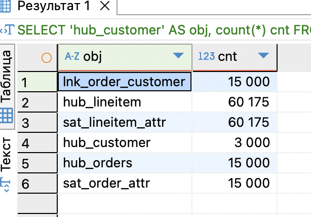

2. Топ-10 клиентов по сумме заказов (через link + sat)
```sql
SELECT
  hc.customer_bk,
  sc.c_name,
  round(sum(so.o_totalprice),2) AS total_price
FROM memory.dds.lnk_order_customer loc
JOIN memory.dds.hub_customer hc
  ON hc.customer_hk = loc.customer_hk
JOIN memory.dds.hub_order ho
  ON ho.order_hk = loc.order_hk
JOIN memory.dds.sat_customer_attr sc
  ON sc.customer_hk = hc.customer_hk AND sc.is_current
JOIN memory.dds.sat_order_attr so
  ON so.order_hk = ho.order_hk AND so.is_current
GROUP BY 1,2
ORDER BY total_price DESC
LIMIT 10;
```
Результат:
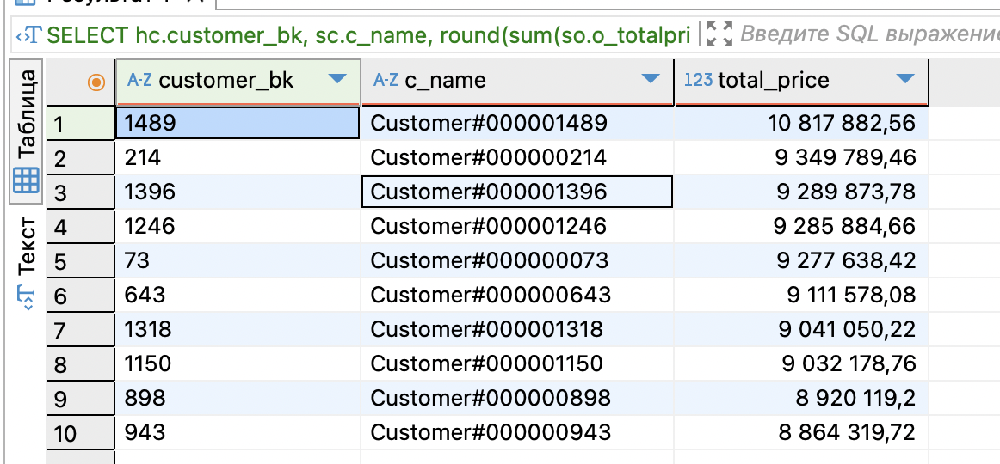

3. Выручка по поставщикам (по позициям: extendedprice*(1-discount))

```sql
SELECT
  hs.supplier_bk,
  ss.s_name,
  round(sum(sl.l_extendedprice * (1 - sl.l_discount)),2) AS revenue
FROM memory.dds.lnk_lineitem_supplier lis
JOIN memory.dds.hub_supplier hs
  ON hs.supplier_hk = lis.supplier_hk
JOIN memory.dds.sat_supplier_attr ss
  ON ss.supplier_hk = hs.supplier_hk AND ss.is_current
JOIN memory.dds.sat_lineitem_attr sl
  ON sl.lineitem_hk = lis.lineitem_hk AND sl.is_current
GROUP BY 1,2
ORDER BY revenue DESC
LIMIT 10;
```
Результат:
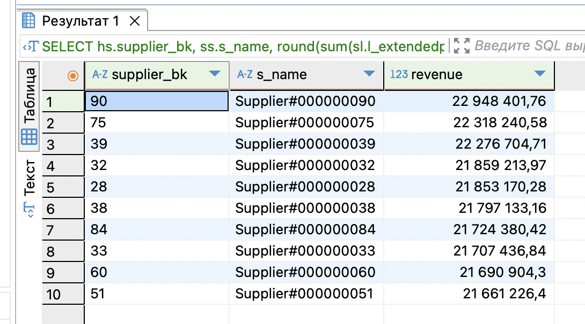

4. Заказы по дням (проверка orderdate как start_date)
```sql
SELECT
  so.o_orderdate,
  count(*) AS orders_cnt,
  round(sum(so.o_totalprice),2) AS total_price
FROM memory.dds.sat_order_attr so
WHERE so.is_current
GROUP BY 1
ORDER BY 1 desc
limit 10;
```

Результат:
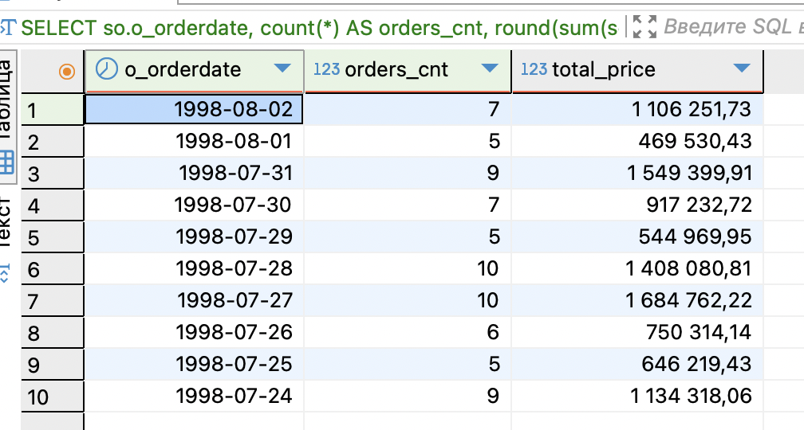

### 4. Модифицировать код загрузки для загрузки данных за день,передаваемый как параметр

Мы сделали ранее полную загрузку данных. Сейчас будем придумывать инкрементальную загрузку как если бы нам нужно было загружать новые данные каждый день.

В SQL пишем плейсхолдер:
- ${run_date} — удобно для DBeaver (SQL Variables)
- формат даты: YYYY-MM-DD

#### Для хабов

```sql
INSERT INTO memory.dds.hub_order
SELECT DISTINCT
  md5(to_utf8(upper(trim(cast(o.orderkey as varchar)))))       AS order_hk,
  upper(trim(cast(o.orderkey as varchar)))                     AS order_bk,
  current_timestamp                                            AS navi_date,
  'tpch.tiny.orders'                                           AS record_source
FROM tpch.tiny.orders o
WHERE o.orderdate = DATE '${run_date}';
```
проверяем работает ли параметр
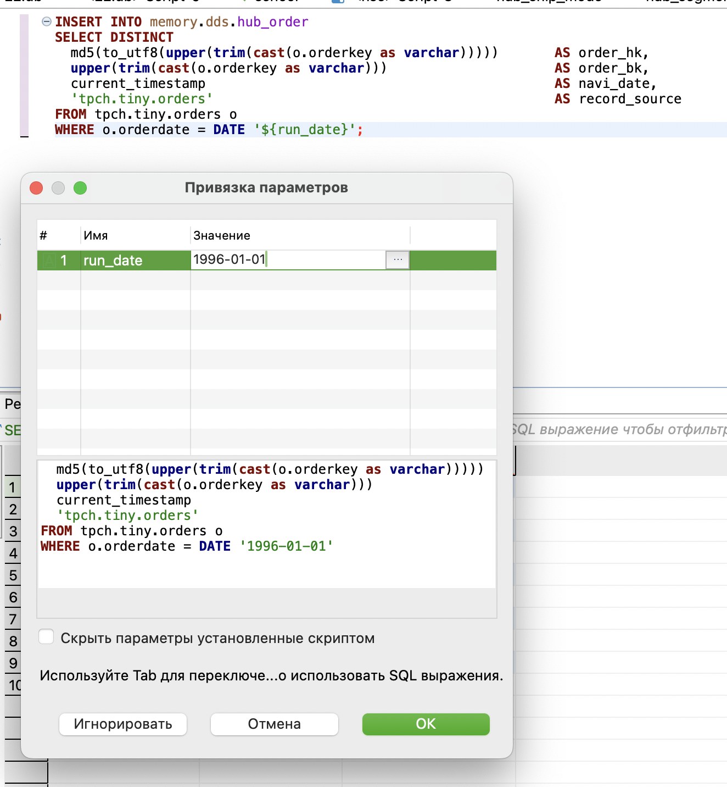

проверяем прошла ли запись
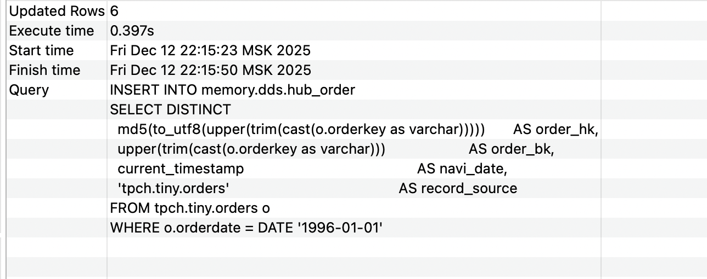

#### Для link
```sql
INSERT INTO memory.dds.lnk_order_customer
SELECT
  md5(to_utf8(upper(trim(concat_ws('|',
      cast(o.orderkey as varchar),
      cast(o.custkey as varchar)
  )))))                                                        AS lnk_hk,
  md5(to_utf8(upper(trim(cast(o.orderkey as varchar)))))       AS order_hk,
  md5(to_utf8(upper(trim(cast(o.custkey as varchar)))))        AS customer_hk,
  current_timestamp                                            AS navi_date,
  'tpch.tiny.orders'                                           AS record_source
FROM tpch.tiny.orders o
WHERE o.orderdate = DATE '${run_date}';
```

проверяем работает ли параметр
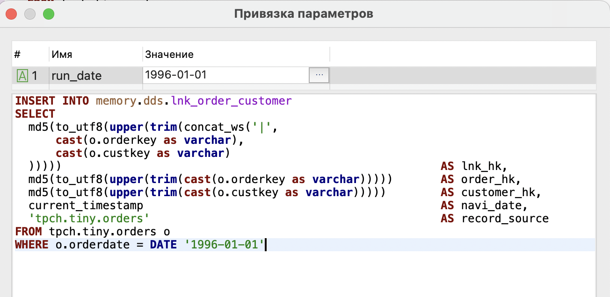

проверяем прошла ли запись
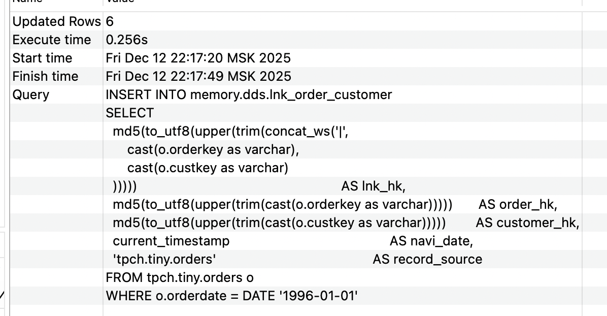

#### Для саттелита

Тут самое интересное. 
memory коннектор Trino не поддерживает UPDATE/DELETE → “настоящий” SCD2 через закрытие строк в этой среде сделать нельзя

В идеале я бы сделал так. Сначала закрыл старые записи
```sql
UPDATE memory.dds.sat_order_attr
SET
  end_date   = date_add('day', -1, DATE '${run_date}'),
  is_current = false,
  navi_date  = current_timestamp
WHERE is_current = true
  AND EXISTS (
    SELECT 1
    FROM tpch.tiny.orders o
    WHERE o.orderdate = DATE '${run_date}'
      AND order_hk = md5(to_utf8(upper(trim(cast(o.orderkey as varchar)))))
      AND hashdiff <> md5(to_utf8(upper(trim(concat_ws('|',
            coalesce(o.orderstatus,''),
            cast(coalesce(o.totalprice, 0.0) as varchar),
            cast(o.orderdate as varchar),
            coalesce(o.orderpriority,''),
            coalesce(o.clerk,''),
            cast(coalesce(o.shippriority, 0) as varchar),
            coalesce(o.comment,'')
      )))))
  );
```
Потом вставил бы новые

```sql
INSERT INTO memory.dds.sat_order_attr
SELECT
  md5(to_utf8(upper(trim(cast(o.orderkey as varchar))))) AS order_hk,
  o.orderstatus, o.totalprice, o.orderdate, o.orderpriority, o.clerk, o.shippriority, o.comment,
  md5(to_utf8(upper(trim(concat_ws('|',
      coalesce(o.orderstatus,''),
      cast(coalesce(o.totalprice, 0.0) as varchar),
      cast(o.orderdate as varchar),
      coalesce(o.orderpriority,''),
      coalesce(o.clerk,''),
      cast(coalesce(o.shippriority, 0) as varchar),
      coalesce(o.comment,'')
  ))))) AS hashdiff,
  DATE '${run_date}' AS start_date,
  DATE '9999-12-31' AS end_date,
  true AS is_current,
  current_timestamp AS navi_date,
  'tpch.tiny.orders' AS record_source
FROM tpch.tiny.orders o
WHERE o.orderdate = DATE '${run_date}'
  AND NOT EXISTS (
    SELECT 1
    FROM memory.dds.sat_order_attr cur
    WHERE cur.order_hk = md5(to_utf8(upper(trim(cast(o.orderkey as varchar)))))
      AND cur.is_current = true
      AND cur.hashdiff = md5(to_utf8(upper(trim(concat_ws('|',
          coalesce(o.orderstatus,''),
          cast(coalesce(o.totalprice, 0.0) as varchar),
          cast(o.orderdate as varchar),
          coalesce(o.orderpriority,''),
          coalesce(o.clerk,''),
          cast(coalesce(o.shippriority, 0) as varchar),
          coalesce(o.comment,'')
      )))))
  );
```

К сожалению так лаконично сделать не получиться, но показать принцип scd2 можно другим путём

Логика:
1. Берём все старые строки SAT.
2. Если строка current и по этому order_hk пришла новая версия с другим hashdiff => “закрываем” её (end_date = run_date-1, is_current=false).
3. Добавляем “новые версии” для:
- новых order_hk (не было current)
- или изменившихся (hashdiff другой)

```sql
DROP TABLE IF EXISTS memory.dds.sat_order_attr_new;

CREATE TABLE memory.dds.sat_order_attr_new AS
WITH src AS (
  SELECT
    md5(to_utf8(upper(trim(cast(o.orderkey as varchar))))) AS order_hk,
    o.orderstatus, o.totalprice, o.orderdate, o.orderpriority, o.clerk, o.shippriority, o.comment,
    md5(to_utf8(upper(trim(concat_ws('|',
      coalesce(o.orderstatus,''),
      cast(coalesce(o.totalprice, 0.0) as varchar),
      cast(o.orderdate as varchar),
      coalesce(o.orderpriority,''),
      coalesce(o.clerk,''),
      cast(coalesce(o.shippriority, 0) as varchar),
      coalesce(o.comment,'')
    ))))) AS hashdiff
  FROM tpch.tiny.orders o
  WHERE o.orderdate = DATE '1996-01-01'
),
closed_old AS (
  SELECT
    t.order_hk,
    t.o_orderstatus, t.o_totalprice, t.o_orderdate, t.o_orderpriority, t.o_clerk, t.o_shippriority, t.o_comment,
    t.hashdiff,
    t.start_date,
    CASE
      WHEN t.is_current = true
           AND s.order_hk IS NOT NULL
           AND t.hashdiff <> s.hashdiff
      THEN date_add('day', -1, DATE '1996-01-01')
      ELSE t.end_date
    END AS end_date,
    CASE
      WHEN t.is_current = true
           AND s.order_hk IS NOT NULL
           AND t.hashdiff <> s.hashdiff
      THEN false
      ELSE t.is_current
    END AS is_current,
    current_timestamp AS navi_date,
    t.record_source
  FROM memory.dds.sat_order_attr t
  LEFT JOIN src s
    ON s.order_hk = t.order_hk
),
new_versions AS (
  SELECT
    s.order_hk,
    s.orderstatus AS o_orderstatus,
    s.totalprice  AS o_totalprice,
    s.orderdate   AS o_orderdate,
    s.orderpriority AS o_orderpriority,
    s.clerk       AS o_clerk,
    s.shippriority AS o_shippriority,
    s.comment     AS o_comment,
    s.hashdiff,
    DATE '1996-01-01' AS start_date,
    DATE '9999-12-31' AS end_date,
    true AS is_current,
    current_timestamp AS navi_date,
    'tpch.tiny.orders' AS record_source
  FROM src s
  LEFT JOIN memory.dds.sat_order_attr cur
    ON cur.order_hk = s.order_hk AND cur.is_current = true
  WHERE cur.order_hk IS NULL OR cur.hashdiff <> s.hashdiff
)
SELECT * FROM closed_old
UNION ALL
SELECT * FROM new_versions;
```

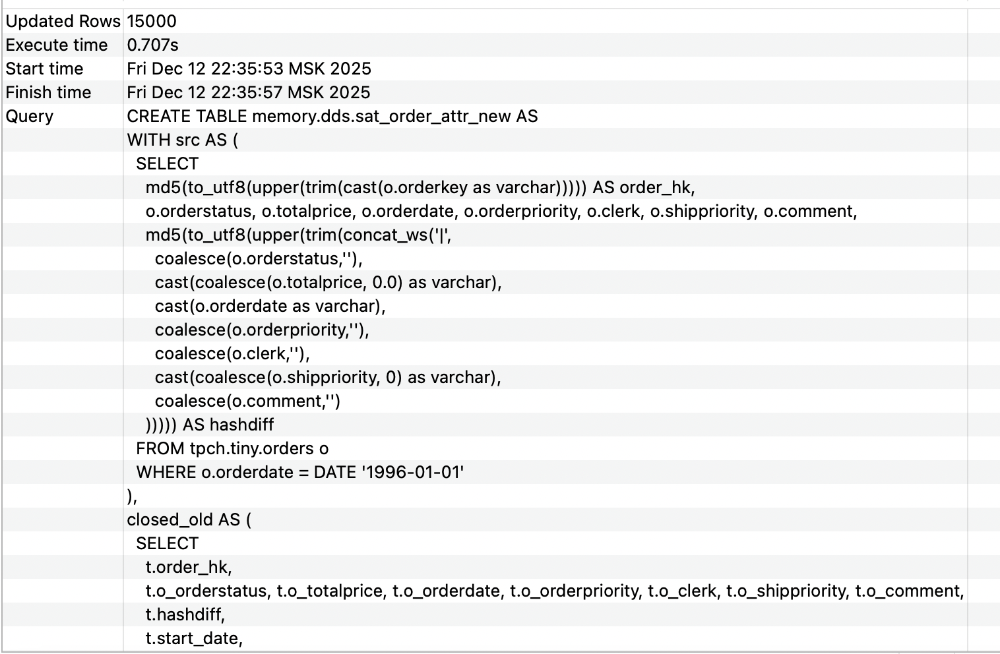


И теперь заменяем старую на новую
```sql
DROP TABLE memory.dds.sat_order_attr;
ALTER TABLE memory.dds.sat_order_attr_new RENAME TO sat_order_attr;
```
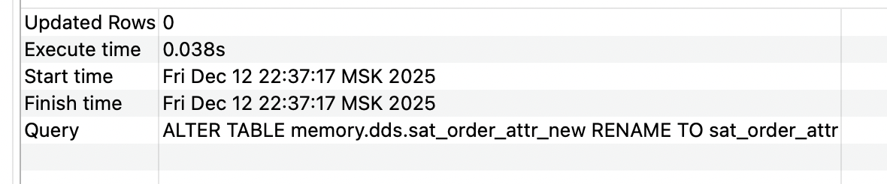


К сожалению, TPC-H — статичный датасет, изменения атрибутов не моделируются, поэтому в реальном прогоне нет записей у которых end_date боьше текущей даты
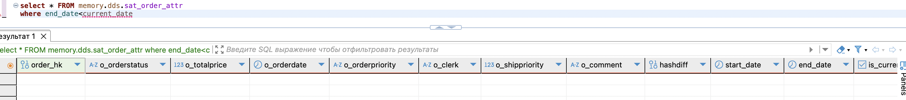
