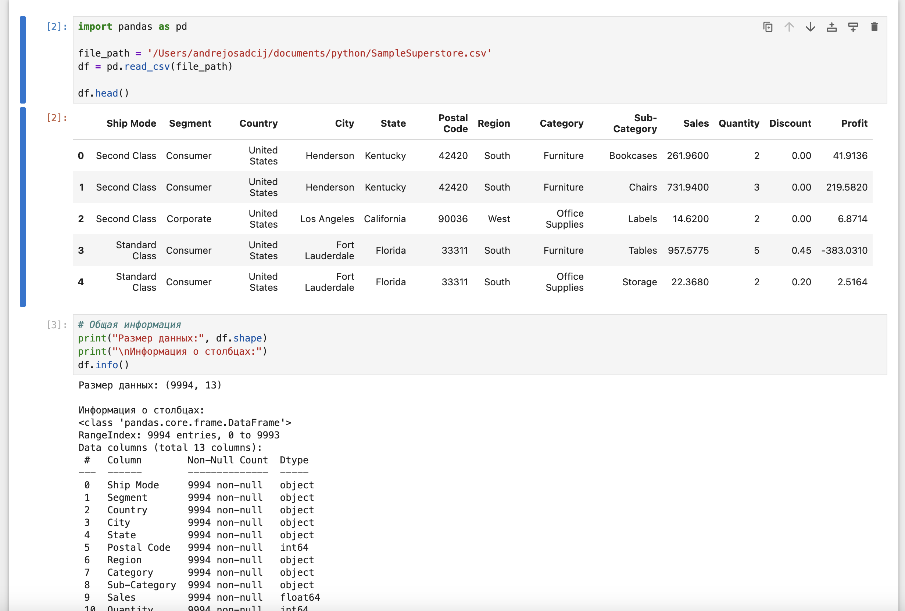
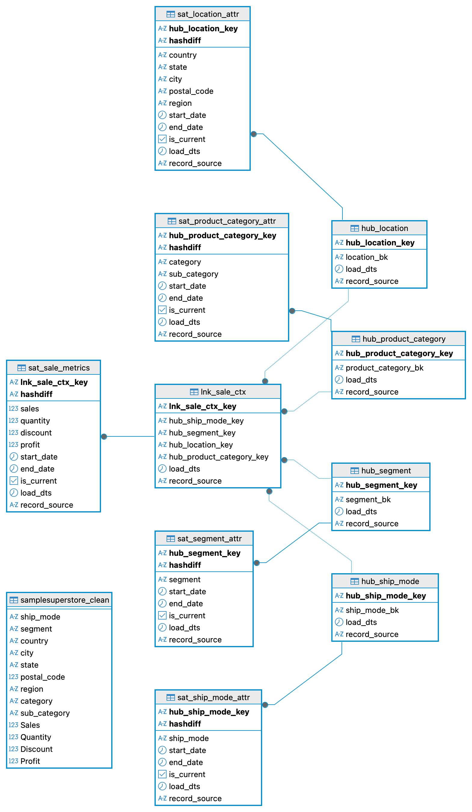
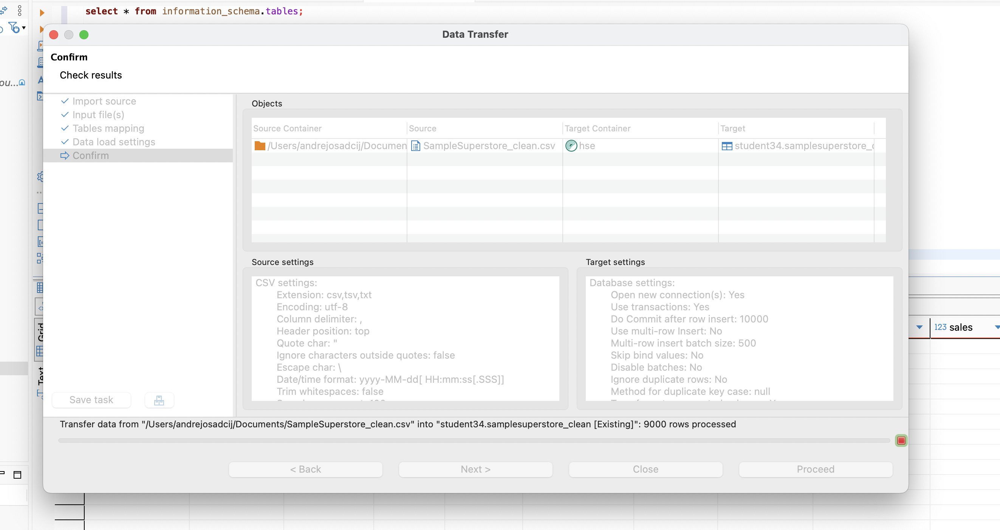
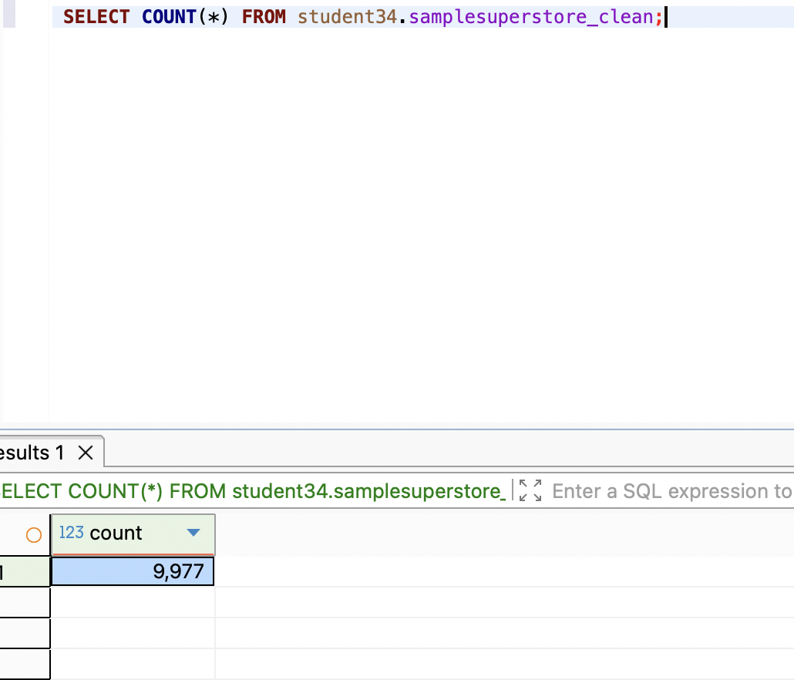

# 📌Итоговое задание по модулю 5
## 🔹Задачи:
- Спроектировать хранилище данных методом моделирования данных Data Vault
- Реализовывать спроектированное хранилище данных в СУБД Greenplum

### Анализ данных
На первом этапе загружаем датасет и смотрим на его содержимое
Создаём эндпоинты (приёмник и источник) и запускаем трансфер

По результатам анализа можно сказать следующее:
- В датасете  присутсвует (13 колонок: Ship Mode, Segment, Country, City, State, Postal Code, Region, Category, Sub-Category, Sales, Quantity, Discount, Profit)
- В датасете присутствуют дублирующиеся строки которые мы убрали
Весь подробный анализ описан тут [тут](https://github.com/andrey-osadchiy/data_storage/tree/main/final/files/DataStorage.ipynb)
### Проектирование данных.
Ознакомившись с данными  мы можем перейти к проектирование БД.
#### Бизнес‑сущности и ключи
**Доступные домены в файле:**
- Доставка: Ship Mode
- Клиентский сегмент: Segment
- География: Country, State, City, Postal Code, Region
- Категория товара: Category, Sub-Category
- Факты продажи: Sales, Quantity, Discount, Profit

**Выбор хабов (Hubs):**
- HUB_SHIP_MODE — бизнес‑ключ: Ship Mode
- HUB_SEGMENT — бизнес‑ключ: Segment
- HUB_LOCATION — бизнес‑ключ: конкатенация Country|State|City|Postal Code|Region
- HUB_PRODUCT_CATEGORY — бизнес‑ключ: Category|Sub-Category

**Линки (Links):**
- LNK_SALE_CTX — связь «контекст продажи»: Ship Mode ↔ Segment ↔ Location ↔ Product Category.

Бизнес‑состав ключа линка: хэш от всех соответствующих бизнес‑ключей из хабов.

**Сателлиты (Satellites):**
- SAT_LOCATION_ATTR (к HUB_LOCATION): хранит дублируемые нат‑атрибуты географии (Country, State, City, Postal Code, Region). Нужен для истории, если в исходнике поменяется, например, соответствие Postal Code ↔ City.
- SAT_PRODUCT_CATEGORY_ATTR (к HUB_PRODUCT_CATEGORY): хранит Category, Sub-Category.
- SAT_SHIP_MODE_ATTR (к HUB_SHIP_MODE): хранит текстовое значение Ship Mode (как атрибут, чтобы версионировать переименования).
- SAT_SEGMENT_ATTR (к HUB_SEGMENT): хранит текст Segment (версионирование).
- SAT_SALE_METRICS (к LNK_SALE_CTX): фактические метрики Sales, Quantity, Discount, Profit.

Общая схема будет следующей 

### Загрузка данных

Далее загрузим очищенный файл в dbeaver.
PS. В реальном проекте мы бы выгрузили в стэджинговую схему, т.к. это учебный проект таблица источник будет находится там же где весь dds слой

Проверим успешность загрузки

### Создание таблиц и их наполнение
