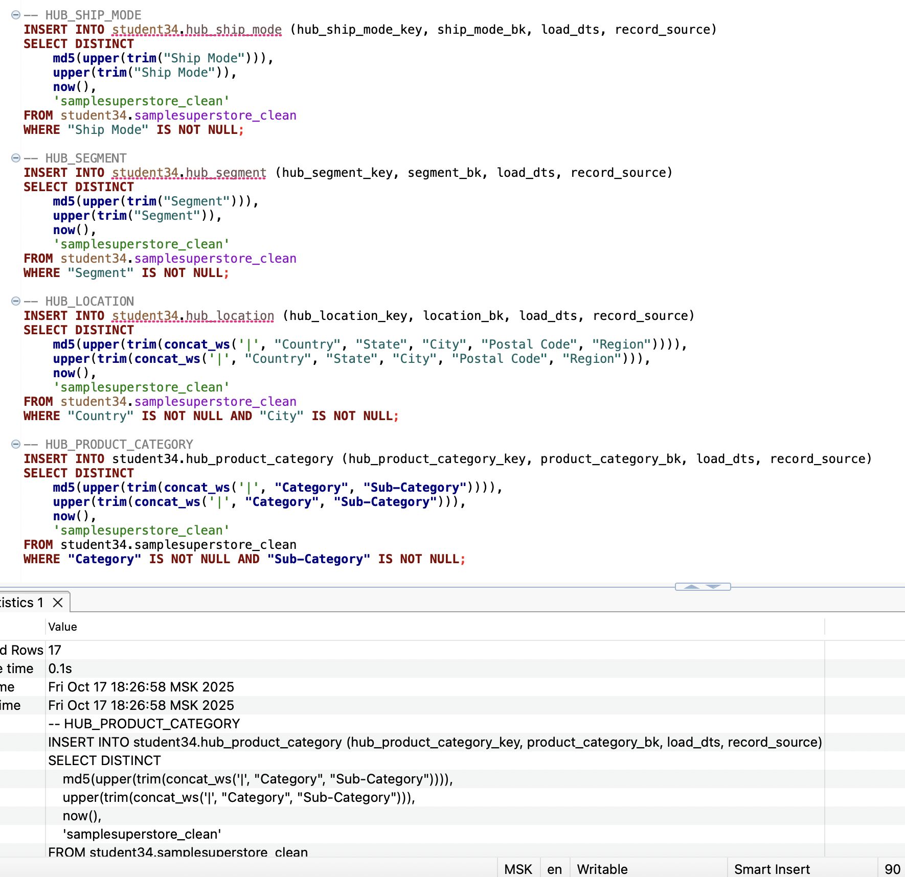
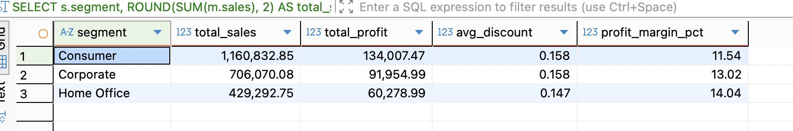
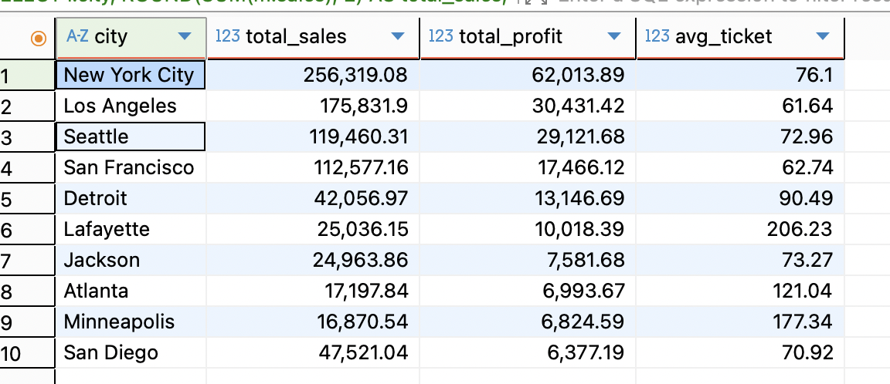

# 📌Итоговое задание по модулю 5
## 🔹Задачи:
- Спроектировать хранилище данных методом моделирования данных Data Vault
- Реализовывать спроектированное хранилище данных в СУБД Greenplum

### Анализ данных
На первом этапе загружаем датасет и смотрим на его содержимое


По результатам анализа можно сказать следующее:
- В датасете  присутсвует (13 колонок: Ship Mode, Segment, Country, City, State, Postal Code, Region, Category, Sub-Category, Sales, Quantity, Discount, Profit)
- В датасете присутствуют дублирующиеся строки которые мы убрали
Весь подробный анализ описан тут [тут](https://github.com/andrey-osadchiy/data_storage/tree/main/final/files/DataStorage.ipynb)
### Проектирование данных.
Ознакомившись с данными  мы можем перейти к проектирование БД.
#### Бизнес‑сущности и ключи
**Доступные домены в файле:**
- Доставка: Ship Mode
- Клиентский сегмент: Segment
- География: Country, State, City, Postal Code, Region
- Категория товара: Category, Sub-Category
- Факты продажи: Sales, Quantity, Discount, Profit

**Выбор хабов (Hubs):**
- HUB_SHIP_MODE — бизнес‑ключ: Ship Mode
- HUB_SEGMENT — бизнес‑ключ: Segment
- HUB_LOCATION — бизнес‑ключ: конкатенация Country|State|City|Postal Code|Region
- HUB_PRODUCT_CATEGORY — бизнес‑ключ: Category|Sub-Category

**Линки (Links):**
- LNK_SALE_CTX — связь «контекст продажи»: Ship Mode ↔ Segment ↔ Location ↔ Product Category.

Бизнес‑состав ключа линка: хэш от всех соответствующих бизнес‑ключей из хабов.

**Сателлиты (Satellites):**
- SAT_LOCATION_ATTR (к HUB_LOCATION): хранит дублируемые нат‑атрибуты географии (Country, State, City, Postal Code, Region). Нужен для истории, если в исходнике поменяется, например, соответствие Postal Code ↔ City.
- SAT_PRODUCT_CATEGORY_ATTR (к HUB_PRODUCT_CATEGORY): хранит Category, Sub-Category.
- SAT_SHIP_MODE_ATTR (к HUB_SHIP_MODE): хранит текстовое значение Ship Mode (как атрибут, чтобы версионировать переименования).
- SAT_SEGMENT_ATTR (к HUB_SEGMENT): хранит текст Segment (версионирование).
- SAT_SALE_METRICS (к LNK_SALE_CTX): фактические метрики Sales, Quantity, Discount, Profit.

Общая схема будет следующей 


### Загрузка данных

Далее загрузим очищенный файл в dbeaver.
PS. В реальном проекте мы бы выгрузили в стэджинговую схему, т.к. это учебный проект таблица источник будет находится там же где весь dds слой

Проверим успешность загрузки


### Создание таблиц и их наполнение
Сначала создадим Хабы
```sql
-- HUB_SHIP_MODE
CREATE TABLE IF NOT EXISTS student34.hub_ship_mode (
    hub_ship_mode_key  CHAR(32) PRIMARY KEY,
    ship_mode_bk       TEXT NOT NULL,
    load_dts           TIMESTAMP NOT NULL,
    record_source      TEXT NOT NULL
)
DISTRIBUTED BY (hub_ship_mode_key);

-- HUB_SEGMENT
CREATE TABLE IF NOT EXISTS student34.hub_segment (
    hub_segment_key  CHAR(32) PRIMARY KEY,
    segment_bk       TEXT NOT NULL,
    load_dts         TIMESTAMP NOT NULL,
    record_source    TEXT NOT NULL
)
DISTRIBUTED BY (hub_segment_key);

-- HUB_LOCATION
CREATE TABLE IF NOT EXISTS student34.hub_location (
    hub_location_key  CHAR(32) PRIMARY KEY,
    location_bk       TEXT NOT NULL,
    load_dts          TIMESTAMP NOT NULL,
    record_source     TEXT NOT NULL
)
DISTRIBUTED BY (hub_location_key);

-- HUB_PRODUCT_CATEGORY
CREATE TABLE IF NOT EXISTS student34.hub_product_category (
    hub_product_category_key  CHAR(32) PRIMARY KEY,
    product_category_bk       TEXT NOT NULL,
    load_dts                  TIMESTAMP NOT NULL,
    record_source             TEXT NOT NULL
)
DISTRIBUTED BY (hub_product_category_key);
```
Далее наполним их данными


Теперь создадим линк
```sql
CREATE TABLE IF NOT EXISTS student34.lnk_sale_ctx (
    lnk_sale_ctx_key          CHAR(32) PRIMARY KEY,
    hub_ship_mode_key         CHAR(32) NOT NULL,
    hub_segment_key           CHAR(32) NOT NULL,
    hub_location_key          CHAR(32) NOT NULL,
    hub_product_category_key  CHAR(32) NOT NULL,
    load_dts                  TIMESTAMP NOT NULL,
    record_source             TEXT NOT NULL
)
DISTRIBUTED BY (lnk_sale_ctx_key);
```

Заполним и его


Остались сателлиты создадим их


И наполним
```sql
INSERT INTO student34.sat_ship_mode_attr (
    hub_ship_mode_key, hashdiff, ship_mode,
    start_date, end_date, is_current,
    load_dts, record_source
)
SELECT
    md5(upper(trim(ship_mode))) AS hub_ship_mode_key,
    md5(upper(trim(ship_mode))) AS hashdiff,
    ship_mode,
    current_date AS start_date,
    DATE '9999-12-31' AS end_date,
    TRUE AS is_current,
    now() AS load_dts,
    'samplesuperstore_clean' AS record_source
FROM student34.samplesuperstore_clean
WHERE ship_mode IS NOT NULL
GROUP BY ship_mode;


INSERT INTO student34.sat_segment_attr (
    hub_segment_key, hashdiff, segment,
    start_date, end_date, is_current,
    load_dts, record_source
)
SELECT
    md5(upper(trim(segment))) AS hub_segment_key,
    md5(upper(trim(segment))) AS hashdiff,
    segment,
    current_date AS start_date,
    DATE '9999-12-31' AS end_date,
    TRUE AS is_current,
    now() AS load_dts,
    'samplesuperstore_clean' AS record_source
FROM student34.samplesuperstore_clean
WHERE segment IS NOT NULL
GROUP BY segment;


INSERT INTO student34.sat_location_attr (
    hub_location_key, hashdiff,
    country, state, city, postal_code, region,
    start_date, end_date, is_current,
    load_dts, record_source
)
SELECT
    md5(upper(trim(concat_ws('|', country, state, city, postal_code, region)))) AS hub_location_key,
    md5(upper(trim(concat_ws('|', country, state, city, postal_code, region)))) AS hashdiff,
    country, state, city, postal_code, region,
    current_date AS start_date,
    DATE '9999-12-31' AS end_date,
    TRUE AS is_current,
    now() AS load_dts,
    'samplesuperstore_clean' AS record_source
FROM student34.samplesuperstore_clean
GROUP BY country, state, city, postal_code, region;


INSERT INTO student34.sat_product_category_attr (
    hub_product_category_key, hashdiff,
    category, sub_category,
    start_date, end_date, is_current,
    load_dts, record_source
)
SELECT
    md5(upper(trim(concat_ws('|', category, sub_category)))) AS hub_product_category_key,
    md5(upper(trim(concat_ws('|', category, sub_category)))) AS hashdiff,
    category, sub_category,
    current_date AS start_date,
    DATE '9999-12-31' AS end_date,
    TRUE AS is_current,
    now() AS load_dts,
    'samplesuperstore_clean' AS record_source
FROM student34.samplesuperstore_clean
GROUP BY category, sub_category;


INSERT INTO student34.sat_sale_metrics (
    lnk_sale_ctx_key, hashdiff,
    sales, quantity, discount, profit,
    start_date, end_date, is_current,
    load_dts, record_source
)
SELECT
    md5(upper(trim(concat_ws('|',
        md5(upper(trim(ship_mode))),
        md5(upper(trim(segment))),
        md5(upper(trim(concat_ws('|', country, state, city, postal_code, region)))),
        md5(upper(trim(concat_ws('|', category, sub_category))))
    )))) AS lnk_sale_ctx_key,
    md5(upper(trim(concat_ws('|',
        coalesce(to_char("Sales", 'FM9999999990D0000'), 'NULL'),
        coalesce("Quantity"::text, 'NULL'),
        coalesce(to_char("Discount", 'FM999990D0000'), 'NULL'),
        coalesce(to_char("Profit", 'FM9999999990D0000'), 'NULL')
    )))) AS hashdiff,
    "Sales", "Quantity", "Discount", "Profit",
    current_date AS start_date,
    DATE '9999-12-31' AS end_date,
    TRUE AS is_current,
    now() AS load_dts,
    'samplesuperstore_clean' AS record_source
FROM student34.samplesuperstore_clean;
```
### На последнем шаге создадим ряд аналитических запросов
Посчитаем какова средняя прибыль и скидка по сегментам клиентов
```sql
SELECT
    s.segment,
    ROUND(SUM(m.sales), 2) AS total_sales,
    ROUND(SUM(m.profit), 2) AS total_profit,
    ROUND(AVG(m.discount), 3) AS avg_discount,
    ROUND(SUM(m.profit)/NULLIF(SUM(m.sales),0)*100, 2) AS profit_margin_pct
FROM student34.sat_sale_metrics m
JOIN student34.lnk_sale_ctx c
    ON m.lnk_sale_ctx_key = c.lnk_sale_ctx_key
JOIN student34.sat_segment_attr s
    ON c.hub_segment_key = s.hub_segment_key
GROUP BY s.segment
ORDER BY total_profit DESC;
```


Выведем Топ-10 городов по прибыли и среднему чеку
```sql
SELECT
    l.city,
    ROUND(SUM(m.sales), 2) AS total_sales,
    ROUND(SUM(m.profit), 2) AS total_profit,
    ROUND(AVG(m.sales / NULLIF(m.quantity, 0)), 2) AS avg_ticket
FROM student34.sat_sale_metrics m
JOIN student34.lnk_sale_ctx c ON m.lnk_sale_ctx_key = c.lnk_sale_ctx_key
JOIN student34.sat_location_attr l ON c.hub_location_key = l.hub_location_key
GROUP BY l.city
ORDER BY total_profit DESC
LIMIT 10;
```


Всё получилось. Все SQL запросы представлены здесь [тут](https://github.com/andrey-osadchiy/data_storage/tree/main/final/SQL/sql.sql)
