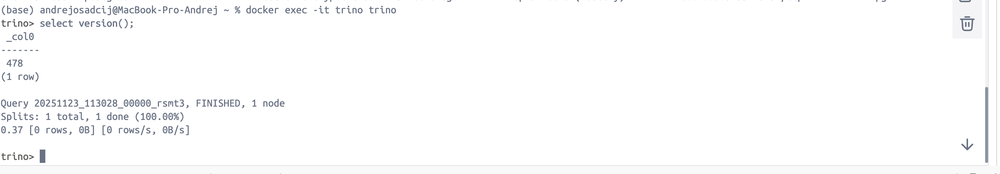
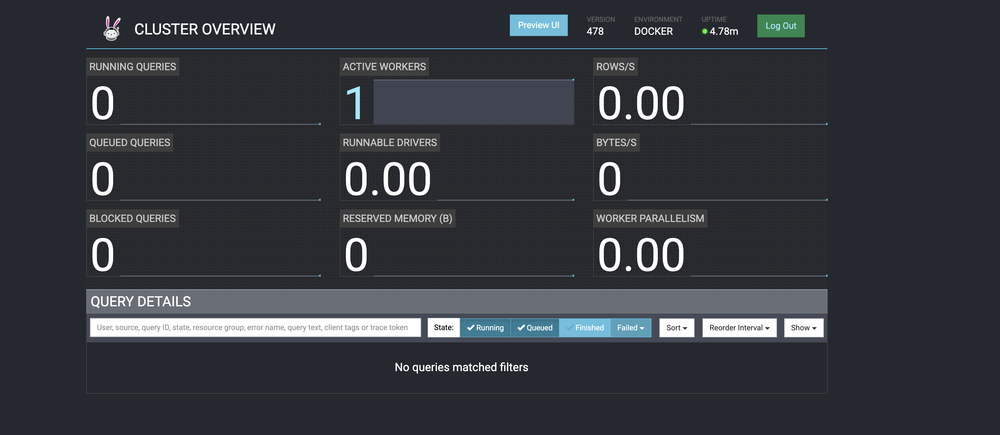
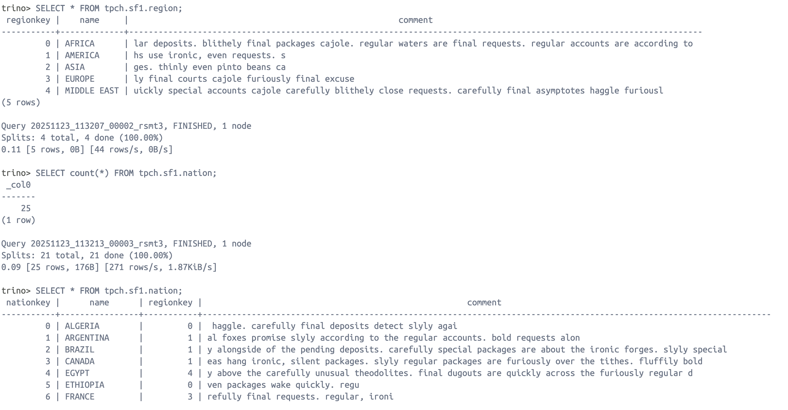
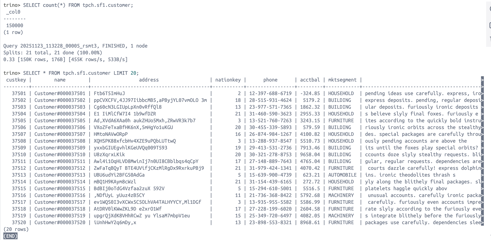
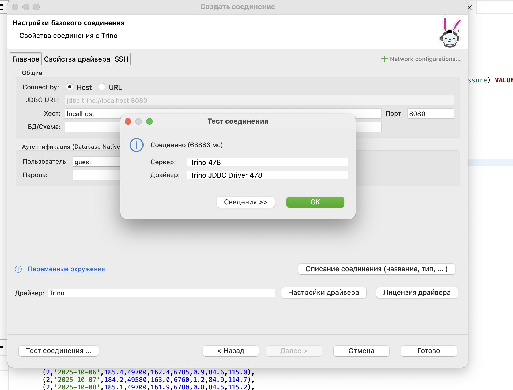
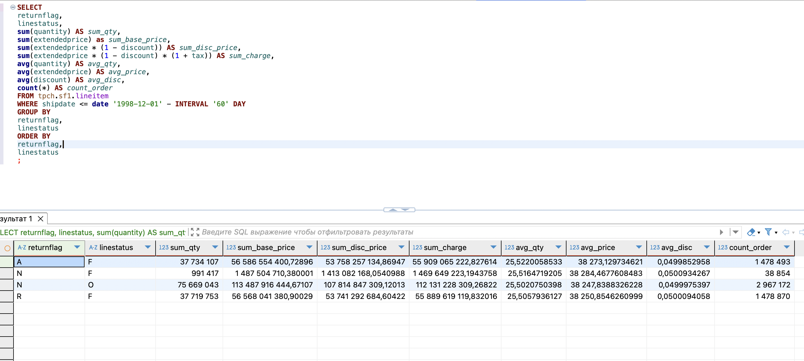
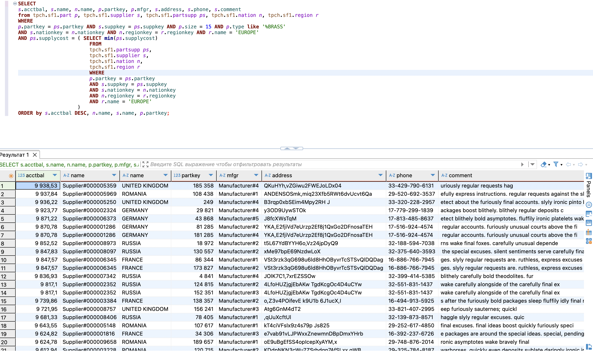
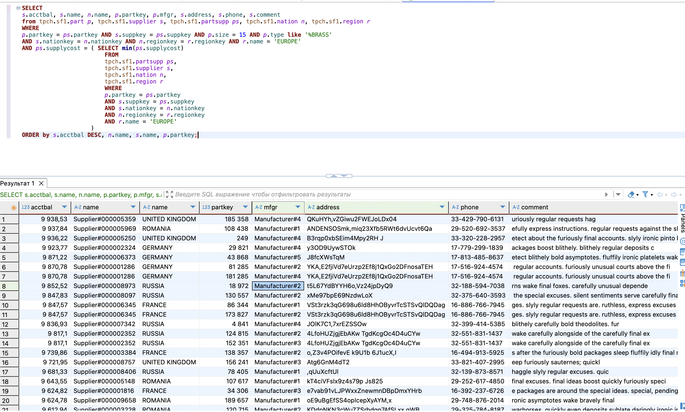

# 📌SQL в Hadoop
### Запускаем Trino и подключаемся через docker

### Осуществляем требуемые запросы в командной строке

### Подключаемся к Trino через бобра

### Делаем необходимые запросы

Результаты запросов представлены в папке files [тут](https://github.com/andrey-osadchiy/data_storage/blob/main/homeworks/SQL_v_Hadoop/files/1.txt) и [тут](https://github.com/andrey-osadchiy/data_storage/blob/main/homeworks/SQL_v_Hadoop/files/2.txt)

