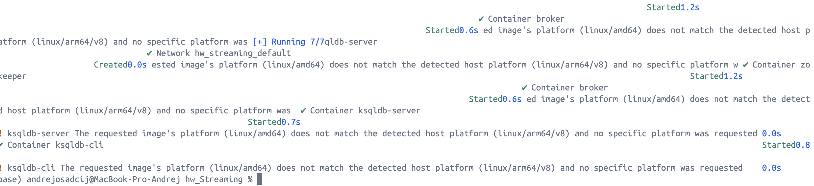
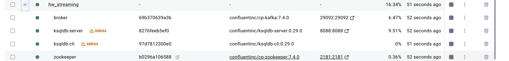
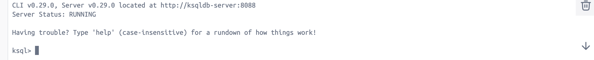
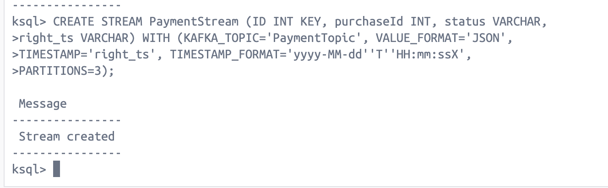
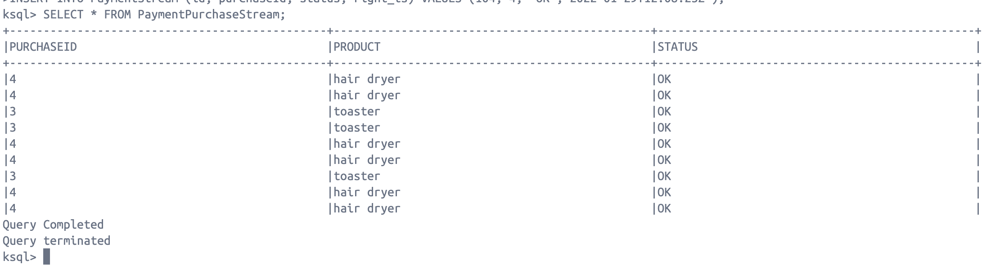

# 📌Streaming
### Создаём файл docker-compose.yml
Сам файл представлен  [тут](https://github.com/andrey-osadchiy/data_storage/blob/main/homeworks/Streaming/screenshots/docker-compose.yml) 
### Выполняем docker compose up

Всё поднялось

### Запускаем ksqldb-cli
используем  команду
```bash
docker exec -it ksqldb-cli ksql http://ksqldb-server:8088
```

### Создаём первый поток

### Создаём второй поток

### CSAS — Create Stream 

### Добавляем записи в потоки
```sql
INSERT INTO PurchaseStream (id, product, left_ts) VALUES (1, 'kettle', '2022-01-29T06:01:18Z');
INSERT INTO PurchaseStream (id, product, left_ts) VALUES (2, 'grill' , '2022-01-29T17:02:20Z');
INSERT INTO PurchaseStream (id, product, left_ts) VALUES (3, 'toaster', '2022-01-29T13:44:10Z');
INSERT INTO PurchaseStream (id, product, left_ts) VALUES (4, 'hair dryer', '2022-01-29T11:58:25Z');
INSERT INTO PaymentStream (id, purchaseId, status, right_ts) VALUES (101, 1, 'OK','2022-01-29T06:11:18Z');
INSERT INTO PaymentStream (id, purchaseId, status, right_ts) VALUES (103, 3, 'OK','2022-01-29T13:54:10Z');
INSERT INTO PaymentStream (id, purchaseId, status, right_ts) VALUES (104, 4, 'OK','2022-01-29T12:08:25Z');
```
### Проверяем объединённый поток

Всё получилось!
